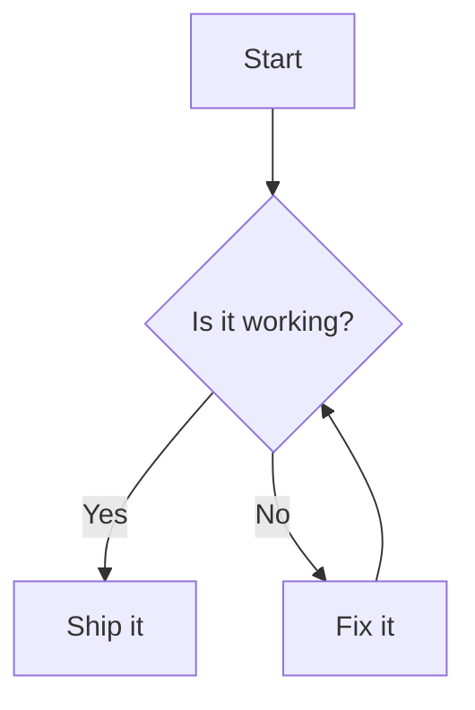

# EN

> Render `mermaid` code blocks as diagrams.

- `mermaid` code blocks are rendered as diagrams
- Follows the site color scheme automatically
- Registers the builtin `DumiPluginMermaid` component, which can be overridden by theme

| Option          | Type     | Default     | Description                                               |
| --------------- | -------- | ----------- | --------------------------------------------------------- |
| `mermaidConfig` | `object` | `undefined` | Passed to `mermaid.initialize`, must be JSON serializable |

## Usage

### Install

> Prerequisites: dumi@2.0.0+

```bash
npm install dumi-plugin-mermaid --save-dev
```

### Apply

```ts
// .dumirc.ts
export default {
  plugins: ['dumi-plugin-mermaid'],
};
```

Then write diagrams with `mermaid` code blocks in Markdown:

<pre lang="markdown">

</pre>

### Options

```ts
// .dumirc.ts
export default {
  plugins: [
    [
      'dumi-plugin-mermaid',
      {
        mermaidConfig: { securityLevel: 'loose' },
      },
    ],
  ],
};
```

### Customization

Put your own implementation at `.dumi/theme/builtins/DumiPluginMermaid.tsx` to take over rendering:

```tsx
export default (props) => {
  return <div>{props.code}</div>;
};
```

`dumi-plugin-mermaid/component` also exports `MermaidToggle`, which renders the diagram with a switch at the top right.
Re-export it to make every diagram switchable:

```tsx
// .dumi/theme/builtins/DumiPluginMermaid.tsx
export { MermaidToggle as default } from 'dumi-plugin-mermaid/component';
```

It takes the same props as the default export (`code` and `mermaidConfig`); anything else is up to your own
implementation.

## Caveats

Only runtime rendering is supported, so the following `rehype-mermaid` options are not available: `strategy`
(`img-png` / `img-svg` / `inline-svg`), `dark`, `colorScheme`, `errorFallback`, `screenshot`, `browser` and
`launchOptions`. Diagrams inside `::: code-group` are rendered in place, which may not match the tabbed layout.

### Full Document

Read more: https://wxh16144.github.io/dumi-plugin-mermaid/

---

# 中文

> 把 `mermaid` 代码块渲染成图表。

- `mermaid` 代码块会被渲染成图表
- 自动跟随站点明暗配色
- 注册内置 `DumiPluginMermaid` 组件，可通过主题覆盖

| 配置项          | 类型     | 默认值      | 说明                                             |
| --------------- | -------- | ----------- | ------------------------------------------------ |
| `mermaidConfig` | `object` | `undefined` | 传给 `mermaid.initialize`，必须是可序列化的 JSON |

## 使用

### 安装

> 前置条件：dumi@2.0.0+

```bash
npm install dumi-plugin-mermaid --save-dev
```

### 配置

```ts
// .dumirc.ts
export default {
  plugins: ['dumi-plugin-mermaid'],
};
```

然后在 Markdown 里用 `mermaid` 代码块书写图表：

<pre lang="markdown">

</pre>

### 选项

```ts
// .dumirc.ts
export default {
  plugins: [
    [
      'dumi-plugin-mermaid',
      {
        mermaidConfig: { securityLevel: 'loose' },
      },
    ],
  ],
};
```

### 自定义

在 `.dumi/theme/builtins/DumiPluginMermaid.tsx` 里给出一份自己的实现，即可接管渲染：

```tsx
export default (props) => {
  return <div>{props.code}</div>;
};
```

`dumi-plugin-mermaid/component` 另外导出了 `MermaidToggle`，它在右上角带一个切换按钮。把它 reexport 出去，就能让所有
图表都可切换：

```tsx
// .dumi/theme/builtins/DumiPluginMermaid.tsx
export { MermaidToggle as default } from 'dumi-plugin-mermaid/component';
```

它的配置项与默认导出一致（`code`、`mermaidConfig`），其余需求可以自行覆盖实现。

## Caveats

Only runtime rendering is supported, so the following `rehype-mermaid` options are not available: `strategy`
(`img-png` / `img-svg` / `inline-svg`), `dark`, `colorScheme`, `errorFallback`, `screenshot`, `browser` and
`launchOptions`. Diagrams inside `::: code-group` are rendered in place, which may not match the tabbed layout.

### Full Document

Read more: https://wxh16144.github.io/dumi-plugin-mermaid/
