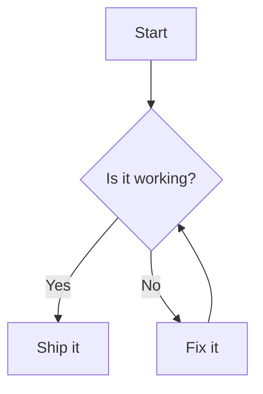

# dumi-plugin-mermaid

> 把 `mermaid` 代码块渲染成图表。

## Usage

### Install

> 前置条件：dumi@2.0.0+

```bash
npm install dumi-plugin-mermaid --save-dev
```

### Apply

```ts
// .dumirc.ts
export default {
  plugins: ['dumi-plugin-mermaid'],
};
```

### Example

<pre lang="markdown">

</pre>

### Options

`mermaidConfig` 会作为 `mermaid.initialize` 的参数，必须是可序列化的 JSON：

```ts
// .dumirc.ts
export default {
  plugins: [['dumi-plugin-mermaid', { mermaidConfig: { securityLevel: 'loose' } }]],
};
```

### Full Document

Read more: https://wxh16144.github.io/dumi-plugin-mermaid/
