用 Mermaid 记录程序员的日常。每种图都是 `mermaid` 代码块，直接复制到支持 Mermaid 的编辑器里就能渲染。

## 修 Bug 循环

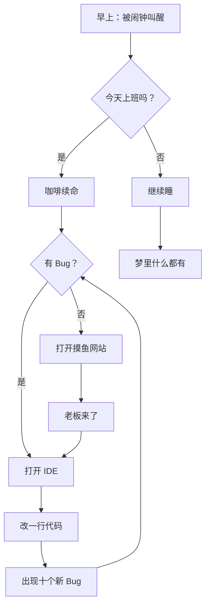

## 产品经理 vs 程序员

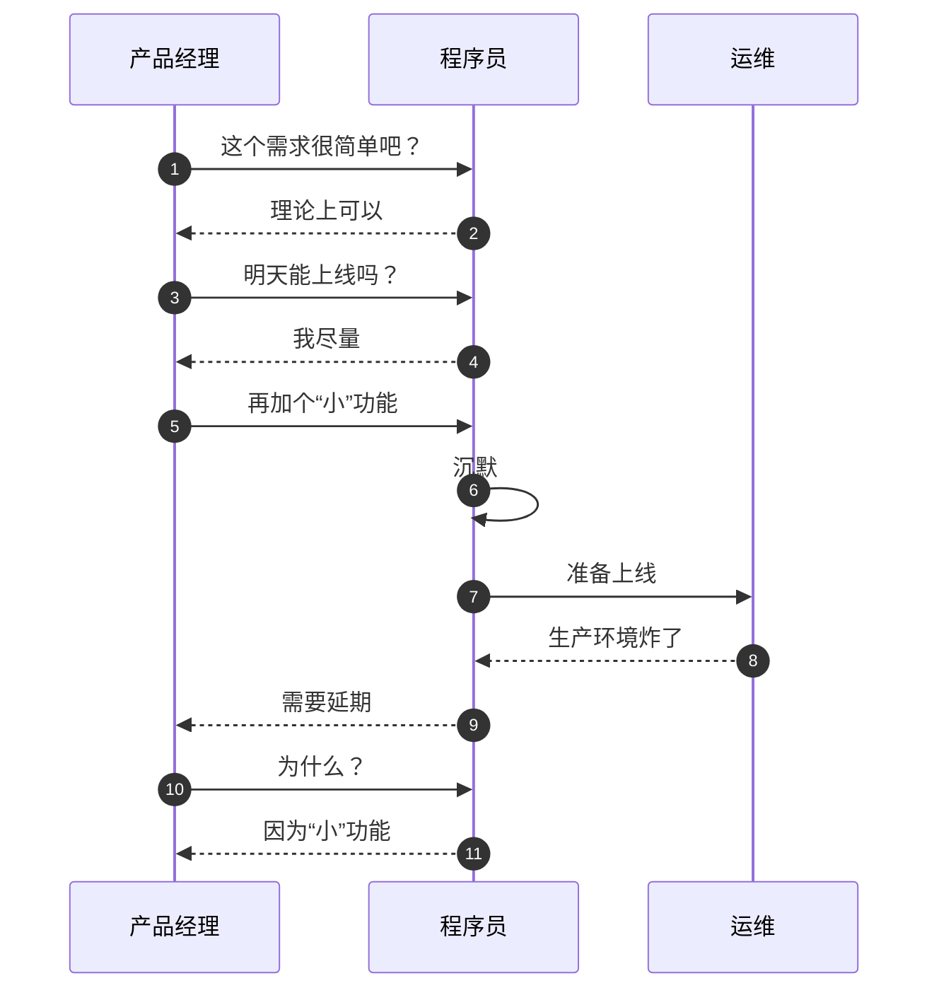

## 猫奴的类图

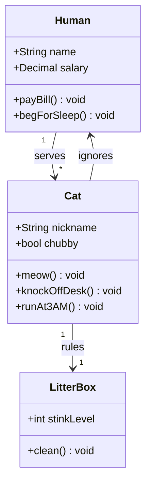

## 打工人状态机

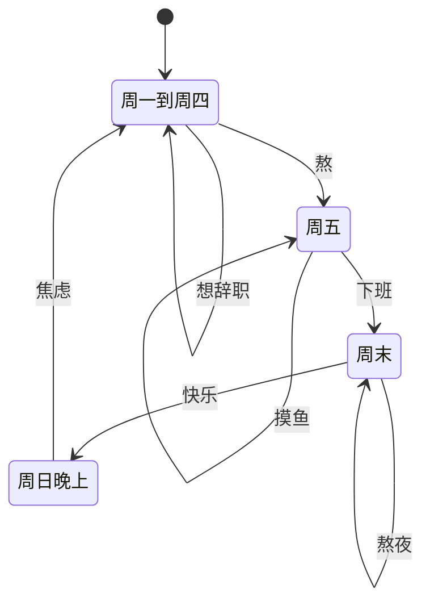

## 猫奴的资产

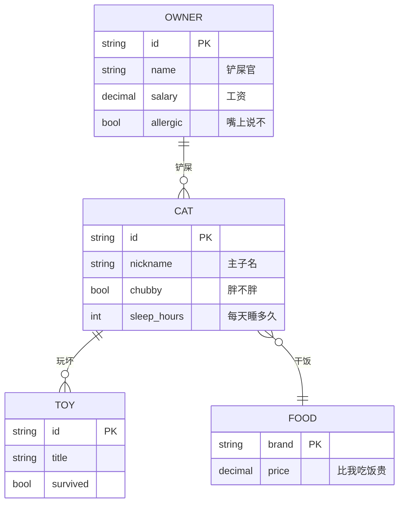

## 咖啡续命计划

```mermaid
gantt
  title 咖啡续命计划
  dateFormat HH:mm
  axisFormat %H:%M
  section 上午
  起床 :a1, 08:00, 15m
  第一杯咖啡 :a2, after a1, 30m
  假装工作 :a3, after a2, 2h
  section 下午
  午餐 :b1, 12:00, 1h
  第二杯咖啡 :b2, after b1, 30m
  会议 :b3, after b2, 2h
  第三杯咖啡 :b4, after b3, 30m
  下班 :b5, after b4, 1h
```

## 周末时间分配

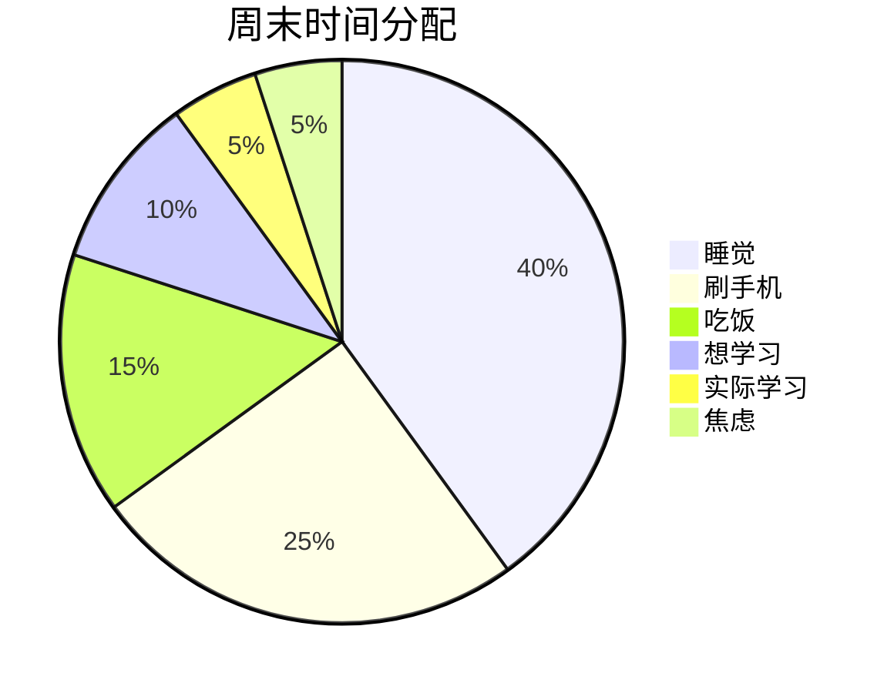

## 分支灾难

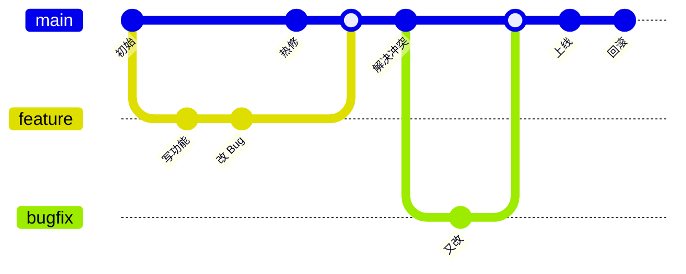

## 代码评审之旅

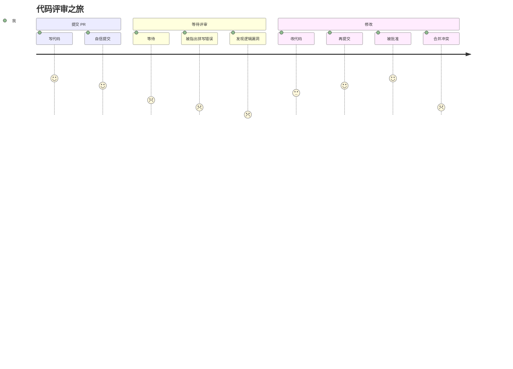

## 学习新技术

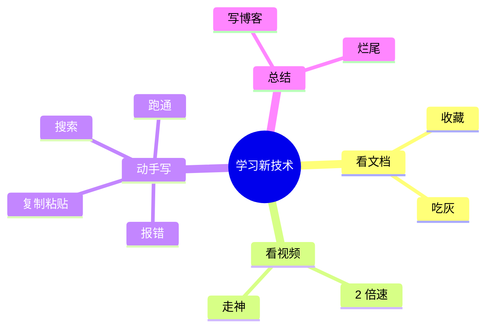

## 打工人的一年

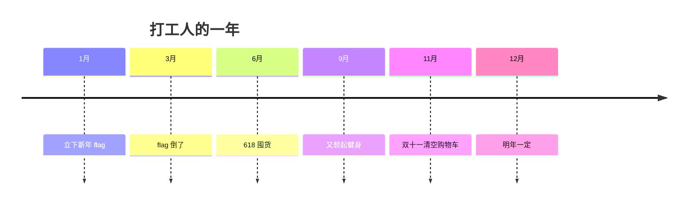

## 摸鱼的性价比

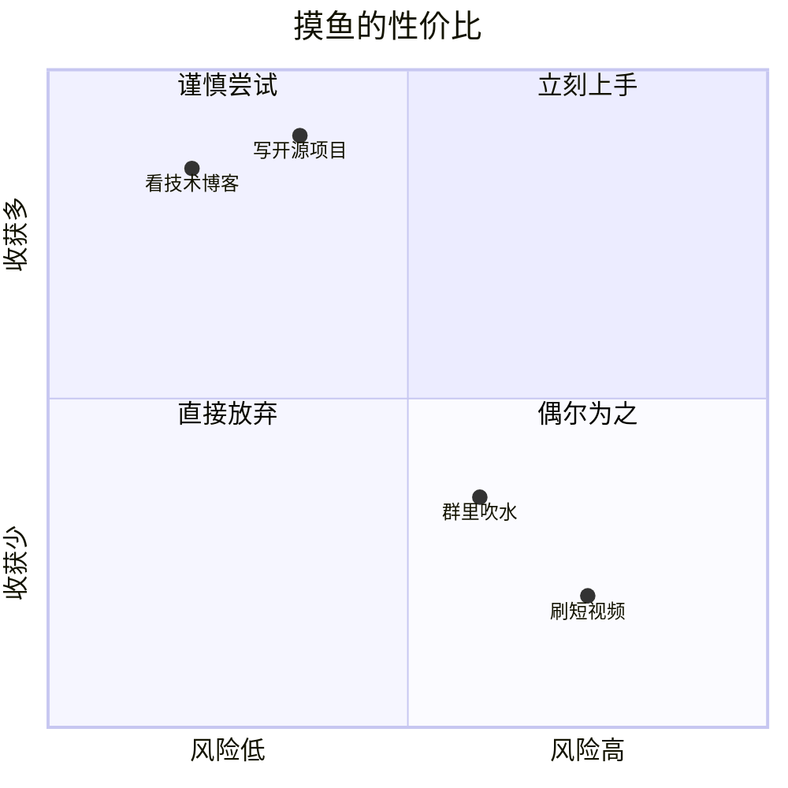

## 咖啡与代码

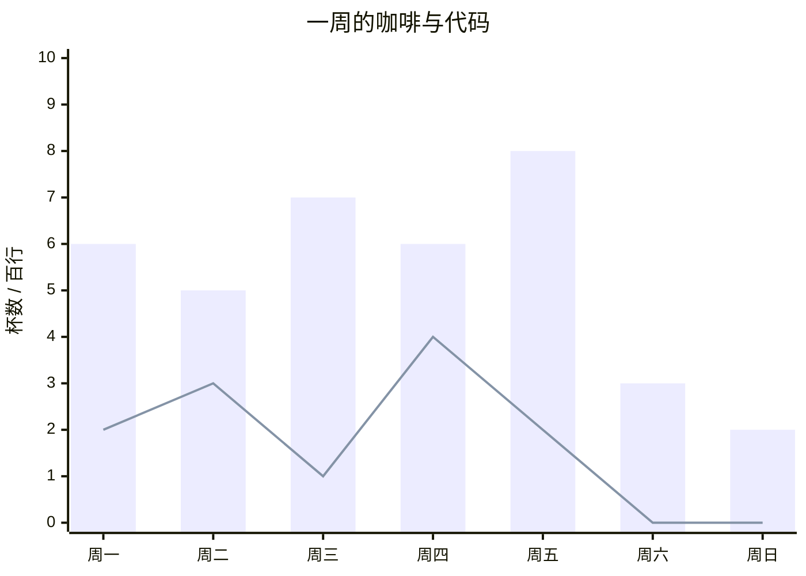

## 工资都去哪了

`sankey-beta` 的语法来自 RFC 4180 CSV，标签只接受可打印 ASCII，所以这张图的节点只能用英文。

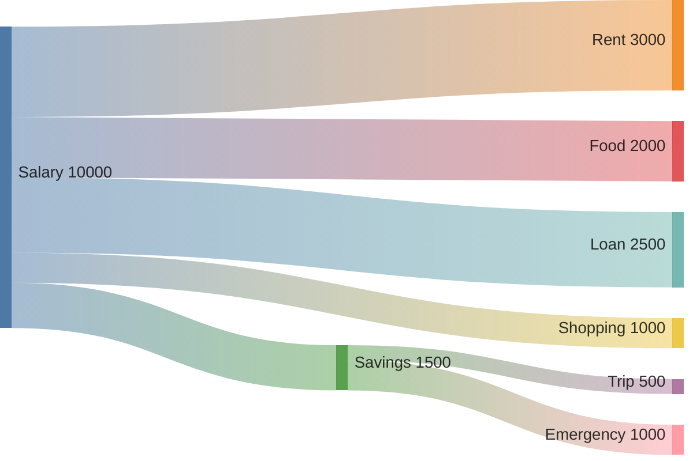

## 一条流水线

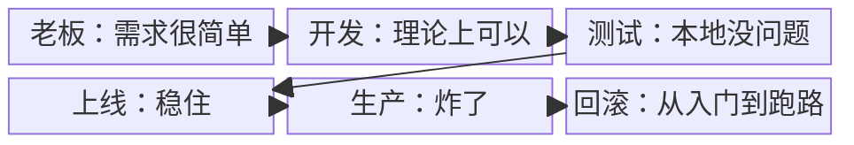

## 需求转移

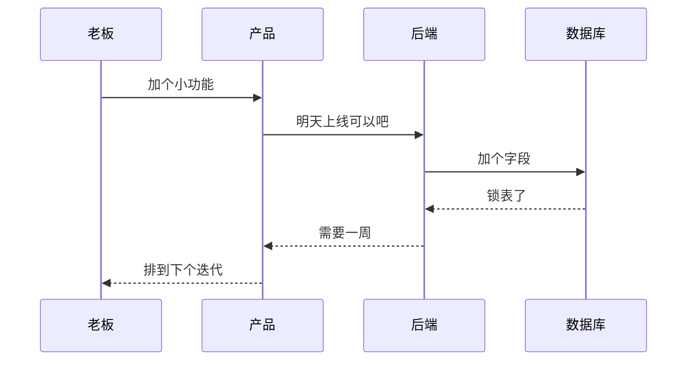

## Bug 流转

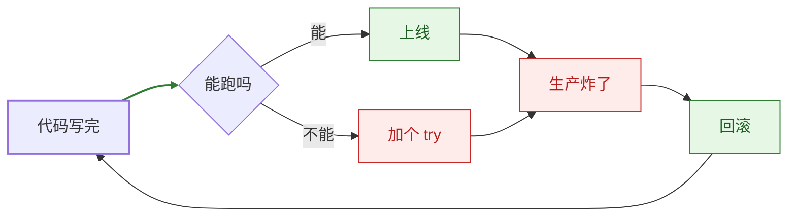
