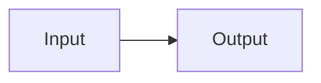
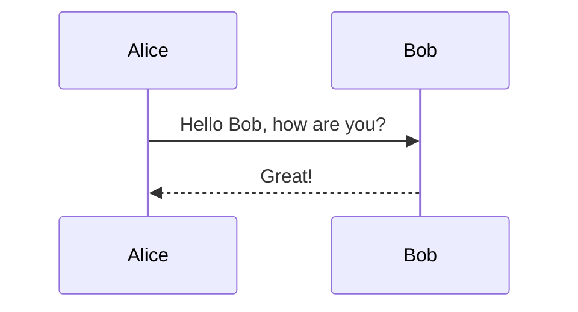
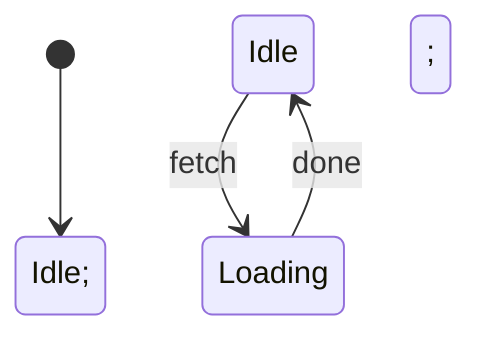

<!-- expected -->

```mermaid
graph LR;
  Input --> Output;
```

```mermaid
sequenceDiagram
  Alice->>Bob: Hello Bob, how are you?
  Bob-->>Alice: Great!
```

```mermaid
stateDiagram-v2
  [*] --> Idle;
  Idle --> Loading: fetch;
  Loading --> Idle: done;
```
