<!-- expected -->

# Mermaid Examples

Classic examples for the diagram types supported by Mermaid.

## Flowchart

<!-- #region flowchart -->

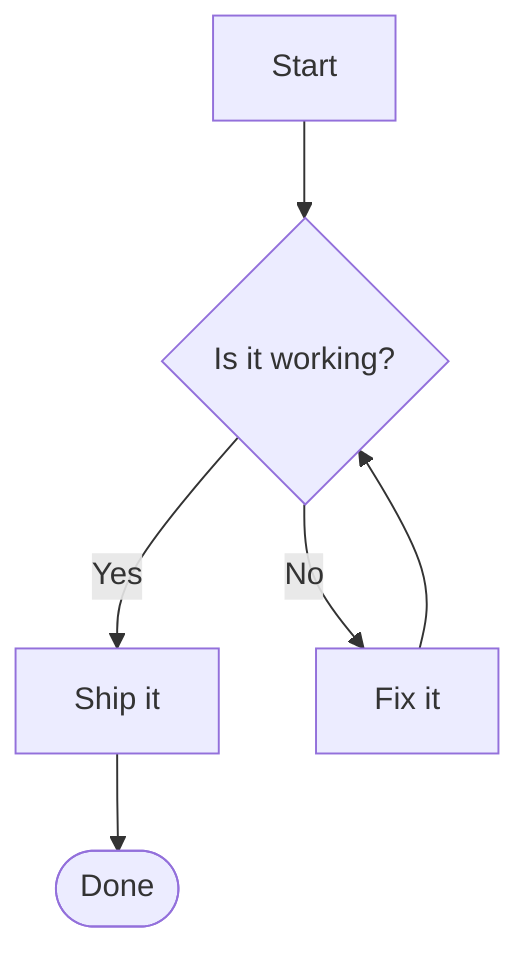

<!-- #endregion flowchart -->

## Sequence Diagram

<!-- #region sequence -->

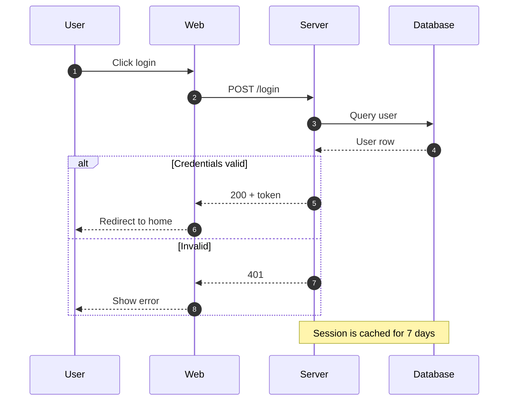

<!-- #endregion sequence -->

## Class Diagram

<!-- #region class -->

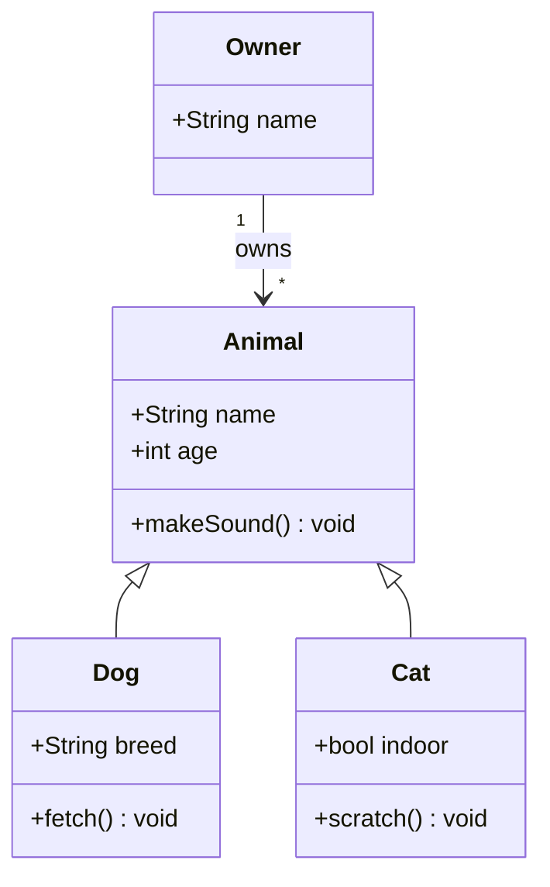

<!-- #endregion class -->

## State Diagram

<!-- #region state -->

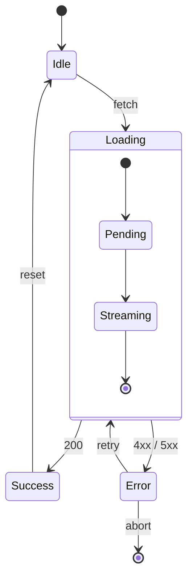

<!-- #endregion state -->

## ER Diagram

<!-- #region er -->

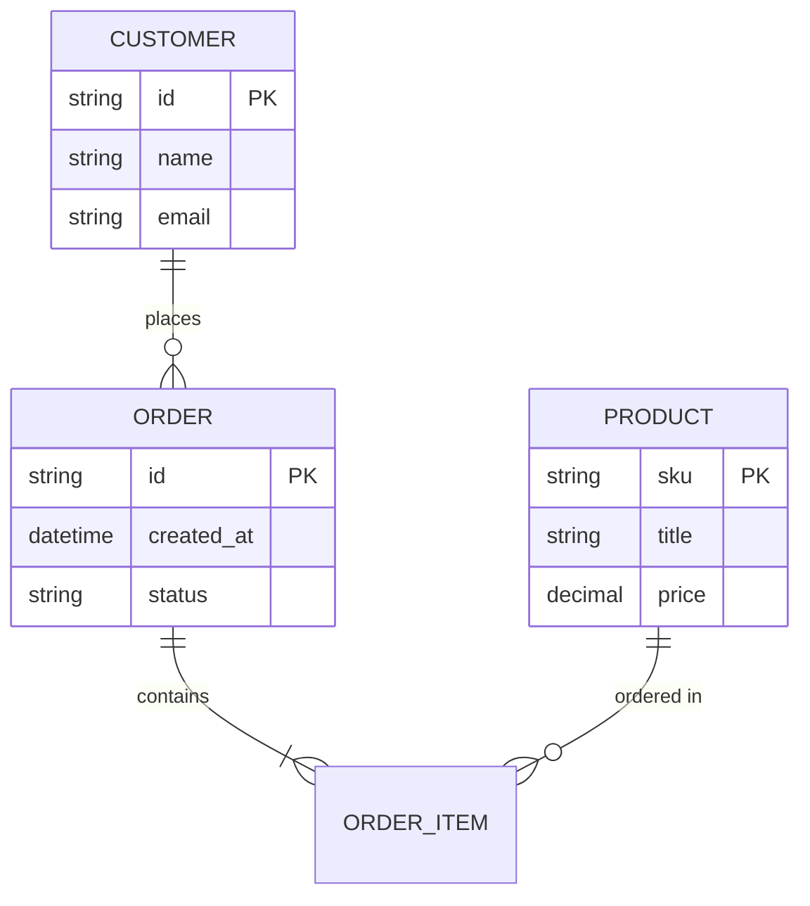

<!-- #endregion er -->

## Gantt Chart

<!-- #region gantt -->

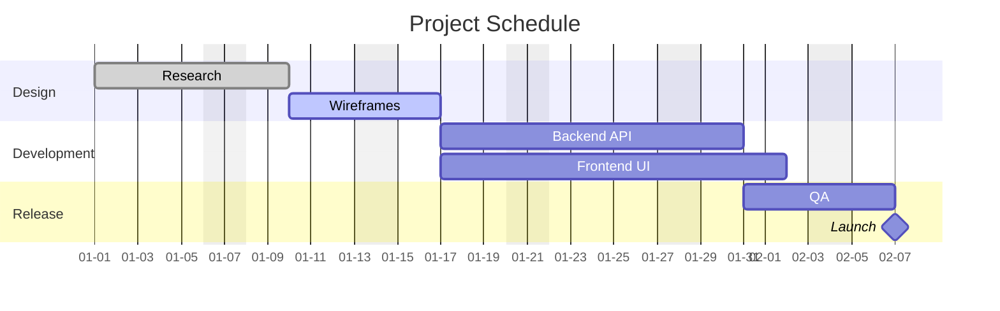

<!-- #endregion gantt -->

## Pie Chart

<!-- #region pie -->

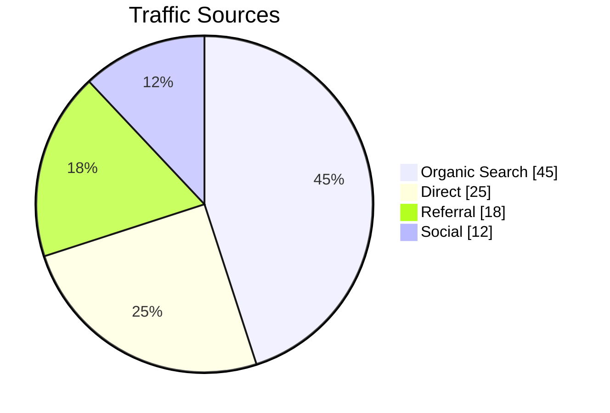

<!-- #endregion pie -->

## Git Graph

<!-- #region git-graph -->

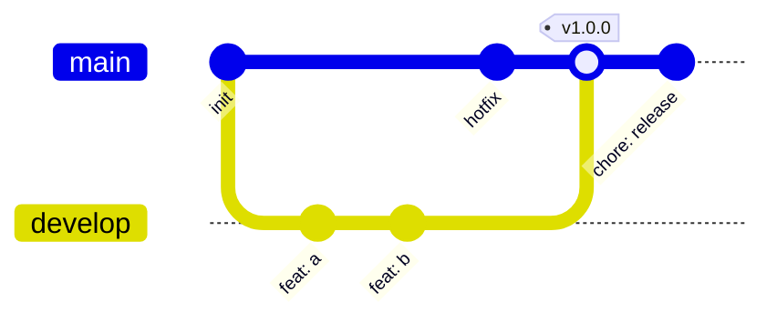

<!-- #endregion git-graph -->

## User Journey

<!-- #region journey -->

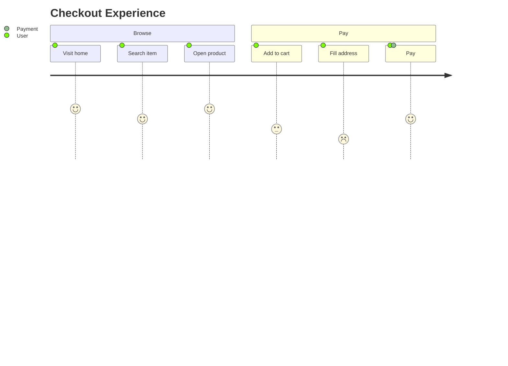

<!-- #endregion journey -->

## Mindmap

<!-- #region mindmap -->

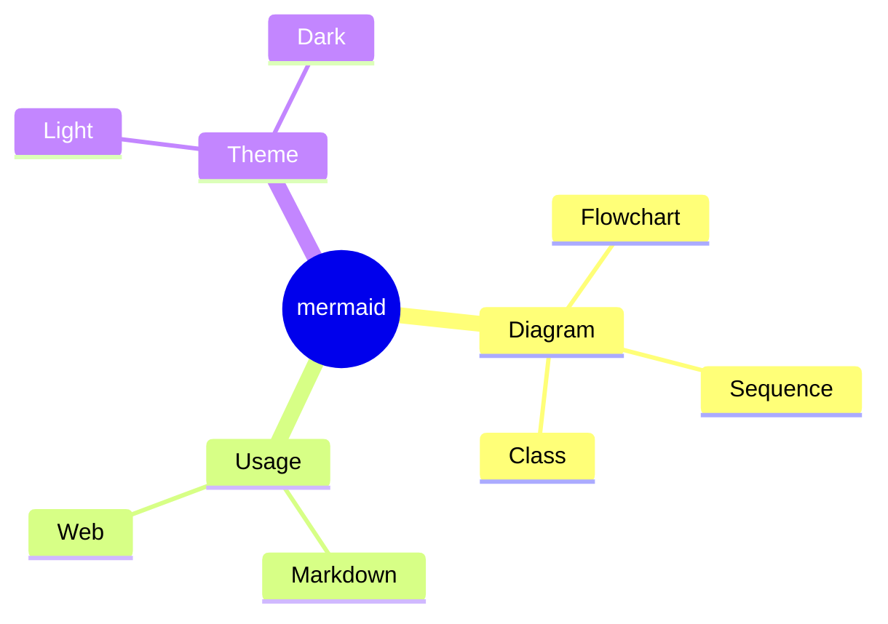

<!-- #endregion mindmap -->

## Timeline

<!-- #region timeline -->

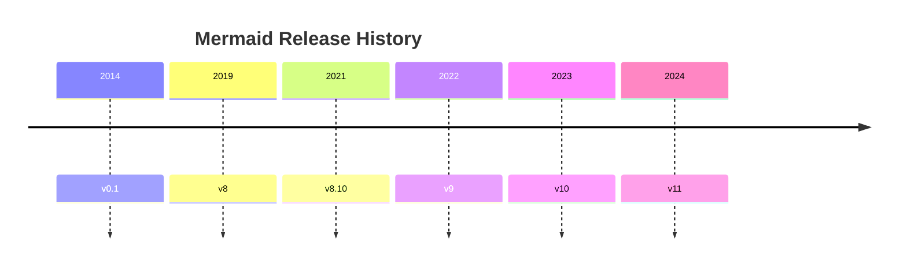

<!-- #endregion timeline -->

## Quadrant Chart

<!-- #region quadrant -->

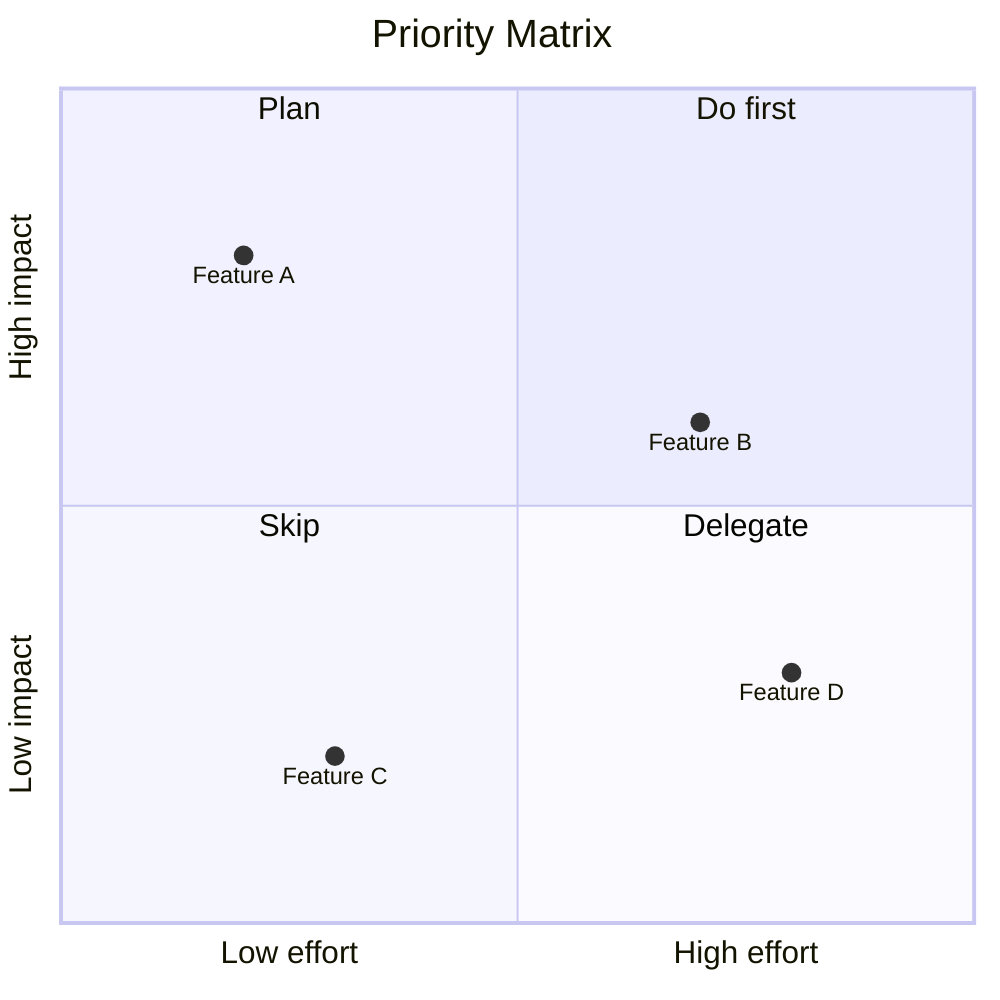

<!-- #endregion quadrant -->

## XY Chart

<!-- #region xy-chart -->

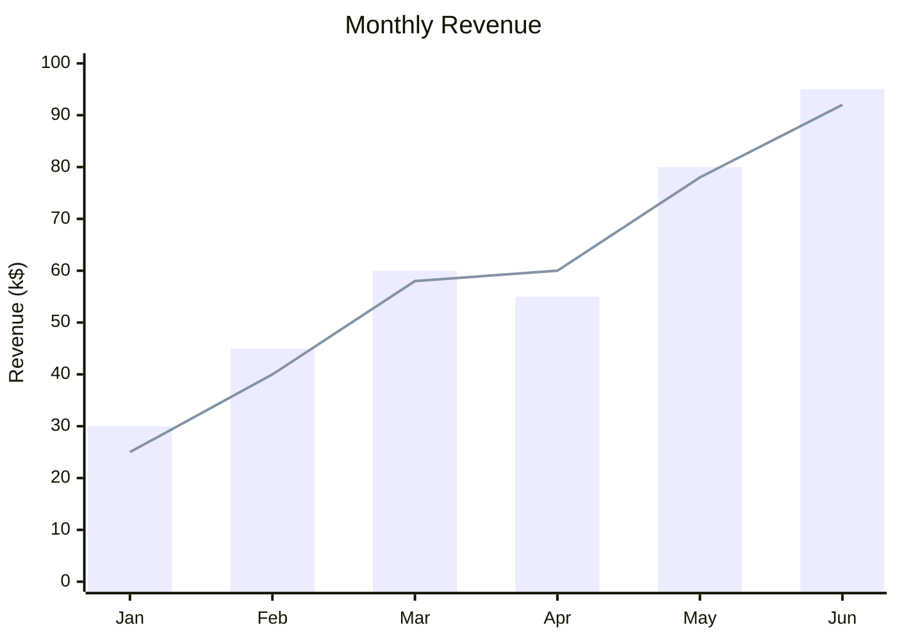

<!-- #endregion xy-chart -->

## Sankey Diagram

<!-- #region sankey -->

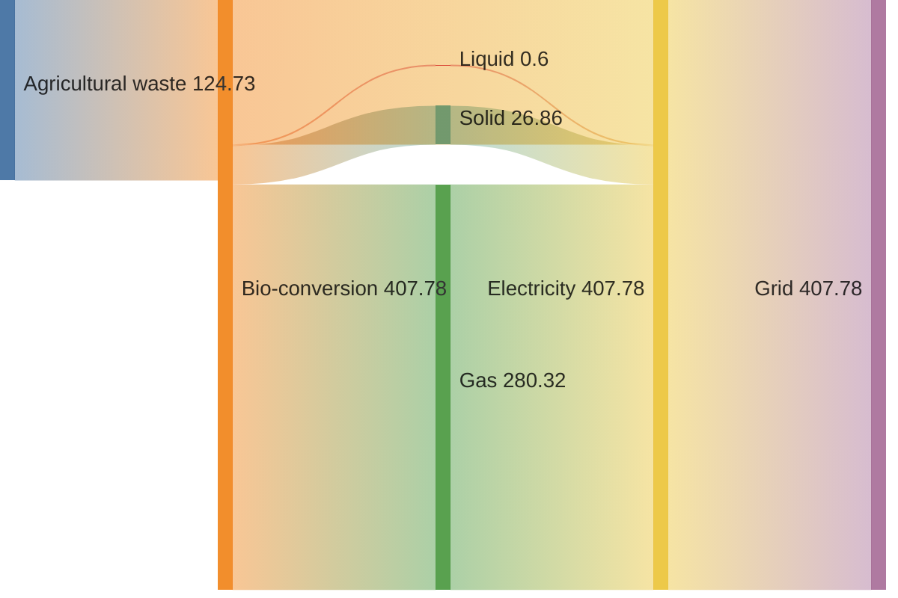

<!-- #endregion sankey -->

## Block Diagram

<!-- #region block -->

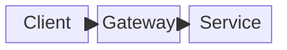

<!-- #endregion block -->

## Multibyte Labels

<!-- #region multibyte -->

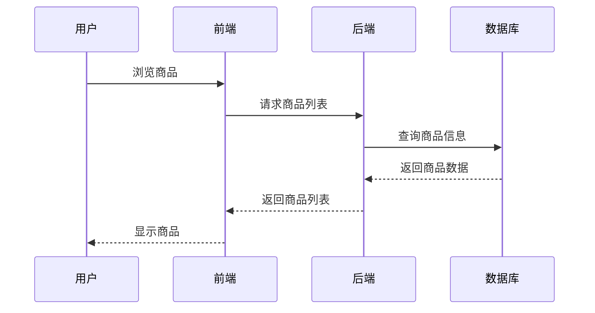

<!-- #endregion multibyte -->

## Style and Class

<!-- #region style -->

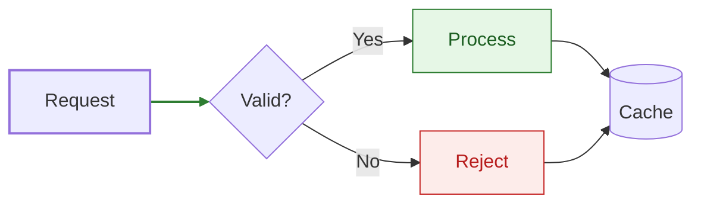

<!-- #endregion style -->
