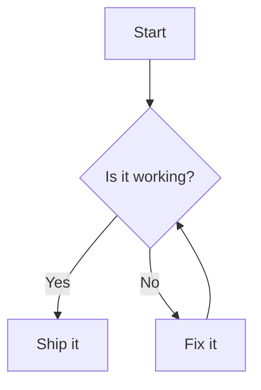

 

## 渲染 Mermaid 图表 灵感来源 [rehype-mermaid](https://github.com/remcohaszing/rehype-mermaid)

 

用 `mermaid` 代码块书写图表，会被渲染为 Mermaid 图表，并跟随站点配色自动切换主题。

点击右上角的明暗切换按钮，图表主题会一起切换。

---

## 更多

| 能力     | 说明                                                            |
| -------- | --------------------------------------------------------------- |
| 代码块   | 使用 `mermaid` 语言标记                                         |
| 主题     | 跟随 dumi 明暗配色（`data-prefers-color` / `prefers-color-scheme`） |
| 初始化项 | 通过插件配置传入 `mermaidConfig`                                |

更多的用法与限制参见 [Usage](/usage)。
