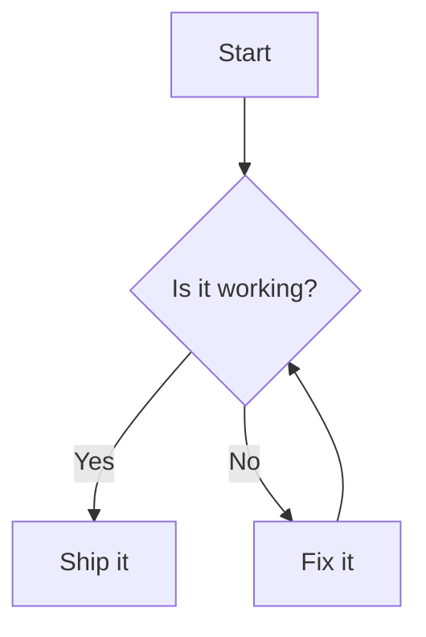

<br>

## 渲染 Mermaid 图表 <sub>借鉴 [rehype-mermaid](https://github.com/remcohaszing/rehype-mermaid)，并为 dumi 做了适配</sub>

<br>

用 `mermaid` 代码块书写图表：

````md

````

会被渲染为图表：


---

## 更多

| 能力     | 说明                                                                |
| -------- | ------------------------------------------------------------------- |
| 代码块   | 使用 `mermaid` 语言标记                                             |
| 主题     | 跟随 dumi 明暗配色（`data-prefers-color` / `prefers-color-scheme`） |
| 初始化项 | 通过插件配置传入 `mermaidConfig`                                    |

更多的用法与限制参见 [Usage](/usage)。
