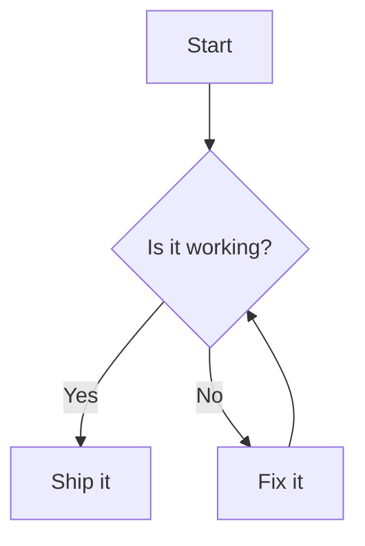

## 安装

> 前置条件：dumi@2.0.0+

:::code-group

```bash [npm]
npm install dumi-plugin-mermaid --save-dev
```

```bash [yarn]
yarn add dumi-plugin-mermaid --dev
```

```bash [pnpm]
pnpm add dumi-plugin-mermaid --save-dev
```

```bash [bun]
bun add dumi-plugin-mermaid --dev
```

:::

<br />

## 使用

```js {3} | pure
// .dumirc.ts
export default {
  plugins: ['dumi-plugin-mermaid'],
};
```

然后在 Markdown 里用 `mermaid` 代码块书写图表：

<pre lang="markdown">

</pre>

## 配置

插件选项会作为 `mermaid.initialize` 的参数，**必须是可序列化的 JSON**。

```js {6-8} | pure
// .dumirc.ts
export default {
  plugins: [
    [
      'dumi-plugin-mermaid',
      {
        mermaidConfig: { securityLevel: 'loose' },
      },
    ],
  ],
};
```

### 自定义

<i>Source Code: [src/component](https://github.com/Wxh16144/dumi-plugin-mermaid/tree/master/src/component)</i>

在 `.dumi/theme/builtins/DumiPluginMermaid.tsx` 里给出一份自己的实现，即可接管渲染：

```js | pure
// .dumi/theme/builtins/DumiPluginMermaid.tsx
export default (props) => {
  return <div>{props.code}</div>;
};
```

#### 切换源码与图表

`dumi-plugin-mermaid/component` 导出以下组件和 Hook：

| 导出            | 说明                                                        |
| --------------- | ----------------------------------------------------------- |
| `default`       | 右上角带切换按钮的图表（等同于 `MermaidToggle`）            |
| `Mermaid`       | 只渲染图表，图表就绪前显示源码                              |
| `MermaidSource` | 只渲染 Mermaid 源码                                         |
| `MermaidToggle` | 等同于默认导出                                              |
| `useMermaid`    | 渲染 Mermaid 源码并返回 `{ svg, error }`，用于组合自定义 UI |

`Mermaid` 与 `MermaidToggle` 接受 `code`、`mermaidConfig` 和可选的 `onRender(svg)`。需要在图表渲染完成后生成下载链接、图片预览等内容时，可以使用 `onRender`：

```tsx | pure
import { MermaidToggle } from 'dumi-plugin-mermaid/component';

export default () => (
  <MermaidToggle
    code="graph TD; A --> B;"
    onRender={(svg) => {
      console.log(svg);
    }}
  />
);
```

默认导出的组件会渲染图表，点击右上角按钮即可查看源码。想只渲染图表、不带切换按钮时：

```js | pure
// .dumi/theme/builtins/DumiPluginMermaid.tsx
export { Mermaid as default } from 'dumi-plugin-mermaid/component';
```

## 限制

仅支持运行时渲染，因此 `rehype-mermaid` 的以下选项不可用：`strategy`（`img-png` / `img-svg` / `inline-svg`）、
`dark`、`colorScheme`、`errorFallback`、`screenshot`、`browser`、`launchOptions`。写在 `::: code-group` 里的图表
会就地渲染，可能与 tab 布局不符。
