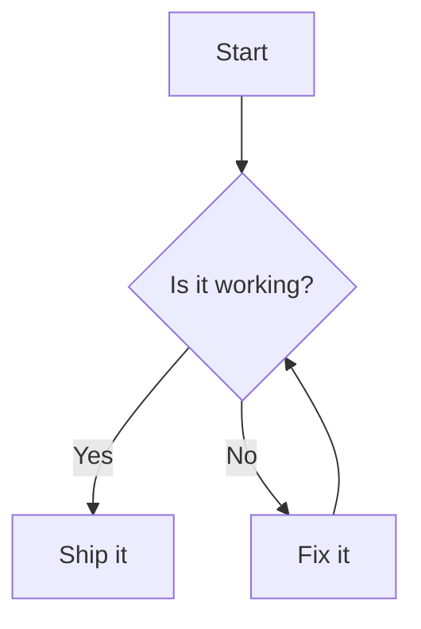

# 安装

```bash
npm install dumi-plugin-mermaid --save-dev
```

# 使用

```js {3} | pure
// .dumirc.ts
export default {
  plugins: ['dumi-plugin-mermaid'],
};
```

然后在 Markdown 里用 `mermaid` 代码块书写图表：

<pre lang="markdown">

</pre>

# 配置

插件选项会作为 `mermaid.initialize` 的参数，**必须是可序列化的 JSON**。

```js {6-8} | pure
// .dumirc.ts
export default {
  plugins: [
    [
      'dumi-plugin-mermaid',
      {
        mermaidConfig: { securityLevel: 'loose' },
      },
    ],
  ],
};
```

## 自定义

<i>Source Code: [src/component/index.tsx](https://github.com/Wxh16144/dumi-plugin-mermaid/blob/master/src/component/index.tsx)</i>

```js | pure
// .dumi/theme/builtins/Mermaid.tsx
export default (props) => {
  return <div>{props.code}</div>;
};
```
