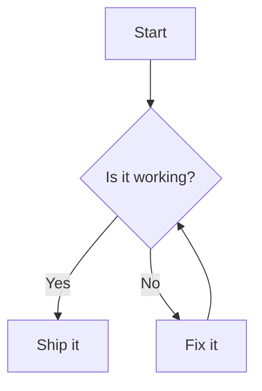

# 安装

```bash
npm install dumi-plugin-mermaid --save-dev
```

# 使用

```js {3} | pure
// .dumirc.ts
export default {
  plugins: ['dumi-plugin-mermaid'],
};
```

然后在 Markdown 里用 `mermaid` 代码块书写图表：

<pre lang="markdown">

</pre>

# 配置

插件选项会作为 `mermaid.initialize` 的参数，**必须是可序列化的 JSON**。

```js {6-8} | pure
// .dumirc.ts
export default {
  plugins: [
    [
      'dumi-plugin-mermaid',
      {
        mermaidConfig: { securityLevel: 'loose' },
      },
    ],
  ],
};
```

## 自定义

<i>Source Code: [src/component](https://github.com/Wxh16144/dumi-plugin-mermaid/tree/master/src/component)</i>

在 `.dumi/theme/builtins/DumiPluginMermaid.tsx` 里给出一份自己的实现，即可接管渲染：

```js | pure
// .dumi/theme/builtins/DumiPluginMermaid.tsx
export default (props) => {
  return <div>{props.code}</div>;
};
```

### 切换源码与图表

`dumi-plugin-mermaid/component` 导出了两个组件，都接受 `code` 与 `mermaidConfig`：

| 导出            | 说明                                             |
| --------------- | ------------------------------------------------ |
| `default`       | 右上角带切换按钮的图表（等同于 `MermaidToggle`） |
| `Mermaid`       | 只渲染图表，图表就绪前显示源码                   |
| `MermaidToggle` | 等同于默认导出                                   |

默认导出的组件会渲染图表，点击右上角按钮即可查看源码。想只渲染图表、不带切换按钮时：

```js | pure
// .dumirc.ts
export { Mermaid as default } from 'dumi-plugin-mermaid/component';
```
