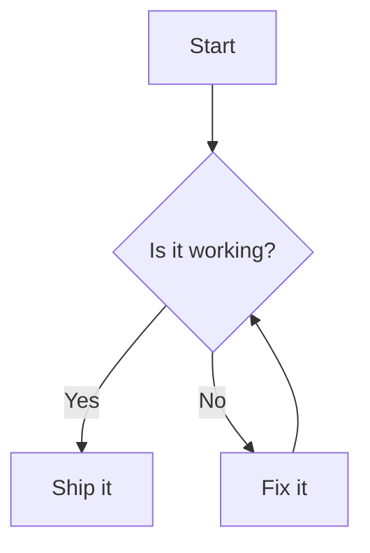

# 安装

```bash
npm install dumi-plugin-mermaid --save-dev
```

# 使用

```js {3} | pure
// .dumirc.ts
export default {
  plugins: ['dumi-plugin-mermaid'],
};
```

然后在 Markdown 里用 `mermaid` 代码块书写图表：

<pre lang="markdown">

</pre>

# 配置

插件选项会作为 `mermaid.initialize` 的参数，**必须是可序列化的 JSON**。

```js {6-8} | pure
// .dumirc.ts
export default {
  plugins: [
    [
      'dumi-plugin-mermaid',
      {
        mermaidConfig: { securityLevel: 'loose' },
      },
    ],
  ],
};
```

## 自定义

<i>Source Code: [src/component/index.tsx](https://github.com/Wxh16144/dumi-plugin-mermaid/blob/master/src/component/index.tsx)</i>

在 `.dumi/theme/builtins/DumiPluginMermaid.tsx` 里给出一份自己的实现，即可接管渲染：

```js | pure
// .dumi/theme/builtins/DumiPluginMermaid.tsx
export default (props) => {
  return <div>{props.code}</div>;
};
```

## 切换源码与图表

`dumi-plugin-mermaid/component` 另外导出了 `MermaidToggle`，它在右上角带一个切换按钮。

把 `MermaidToggle` reexport 出去，就能让所有图表都可切换：

```js | pure
// .dumi/theme/builtins/DumiPluginMermaid.tsx
export { MermaidToggle as default } from 'dumi-plugin-mermaid/component';
```

它默认展示图表，点击右上角按钮即可查看源码；配置项与默认导出一致：

| 配置项          | 类型     | 默认值      | 说明             |
| --------------- | -------- | ----------- | ---------------- |
| `code`          | `string` | -           | mermaid 图表源码 |
| `mermaidConfig` | `object` | `undefined` | 同插件配置       |
